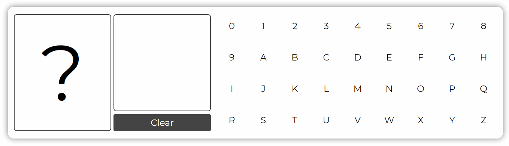

# [Character Recognition in TensorFlowJS](https://alexfsmirnov.github.io/tfjs-classification-demo/)

This is a demo of running a classification neural network in a browser using React and TensorFlowJS. Try it yourself here: https://alexfsmirnov.github.io/tfjs-classification-demo/


## Training the model

While it is possible to train the model in JavaScript using TensorFlowJS, it's a lot easier to train and export it using Python. In the repo you can find a Jupyter Notebook - `CharacterRecognitionTraining.ipynb`. It contains all the data and code needed to create and export a model for character recognition in images. For best results use [Google Colab](https://colab.research.google.com/) and enable GPU Runtime.

## Using the model in JS

All of the tools needed to run the model are provided in the [`@tensorflow/tfjs`](https://www.tensorflow.org/js/tutorials/setup#installation_from_npm) package. You only need a few steps to get started:

- Install and import the package
    ```js
    import tf from '@tensorflow/tfjs';
    ```

- Drop the model into the `public` folder

- Load the model
    ```js
    this.model = await loadLayersModel(`${process.env.PUBLIC_URL}/model/model.json`);
    ```

- Collect the pixel data of an image into a 3d array with shape `[IMG_WIDTH x IMAGE_HEIGHT x CHANNELS]` where `CHANNELS` is the number of colors for each pixel (usually 3 - red, green and blue)

- Use the model to predict the class
    ```typescript
    const inputTensor = tensor([input], [1, IMAGE_SIZE, IMAGE_SIZE, 3]);
    const result = this.model.predict(inputTensor) as Tensor;
    ```

- You'll receive a 1d array with `result.length === numberOfClasses` with each element containing the probability of the input containing that class.

That's it!